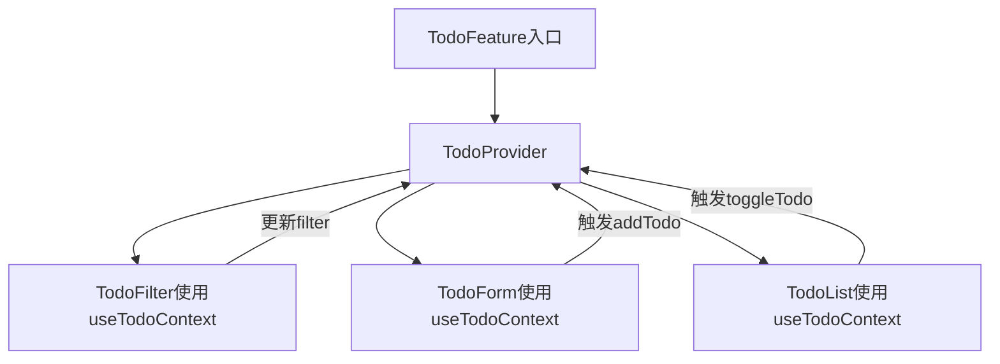

# 实践指南

以下是一个基于 `features/TodoList` 目录结构的具体实现示例，包含完整的代码演示：

```bash
features/
└── TodoList/
    ├── api/
    │   ├── todoApi.js       # API 接口
    │   └── todoEndpoints.js # API 端点配置
    ├── hooks/
    │   ├── useTodos.js      # 数据获取逻辑
    │   └── useTodoActions.js # 操作逻辑
    ├── components/
    │   ├── TodoItem/
    │   │   ├── index.jsx
    │   │   └── style.css
    │   └── TodoFilter/
    │       ├── index.jsx
    │       └── style.css
    ├── context/
    │   └── TodoContext.js   # 模块上下文
    └── index.jsx            # 模块入口
```

### 具体代码实现

#### 1. API 层 (`api/todoApi.js`)
```javascript
import axios from 'axios';
import { TODO_ENDPOINTS } from './todoEndpoints';

export const fetchTodos = async (filter) => {
  const response = await axios.get(TODO_ENDPOINTS.list, {
    params: { filter }
  });
  return response.data;
};

export const createTodo = async (text) => {
  const response = await axios.post(TODO_ENDPOINTS.create, { text });
  return response.data;
};

export const toggleTodo = async (id) => {
  const response = await axios.patch(TODO_ENDPOINTS.update(id), { completed: true });
  return response.data;
};
```

#### 2. Hooks 层 (`hooks/useTodos.js`)
```javascript
import { useState, useEffect } from 'react';
import { fetchTodos } from '../api/todoApi';

export const useTodos = (initialFilter = 'all') => {
  const [todos, setTodos] = useState([]);
  const [filter, setFilter] = useState(initialFilter);
  const [loading, setLoading] = useState(false);
  const [error, setError] = useState(null);

  useEffect(() => {
    const loadTodos = async () => {
      try {
        setLoading(true);
        const data = await fetchTodos(filter);
        setTodos(data);
      } catch (err) {
        setError(err.message);
      } finally {
        setLoading(false);
      }
    };

    loadTodos();
  }, [filter]);

  return { todos, filter, loading, error, setFilter };
};
```

#### 3. 操作逻辑层 (`hooks/useTodoActions.js`)
```javascript
import { useCallback } from 'react';
import { createTodo, toggleTodo } from '../api/todoApi';

export const useTodoActions = (setTodos) => {
  const addTodo = useCallback(async (text) => {
    try {
      const newTodo = await createTodo(text);
      setTodos(prev => [...prev, newTodo]);
    } catch (error) {
      console.error('Failed to add todo:', error);
    }
  }, [setTodos]);

  const toggleTodoStatus = useCallback(async (id) => {
    try {
      const updatedTodo = await toggleTodo(id);
      setTodos(prev => 
        prev.map(todo => 
          todo.id === id ? { ...todo, ...updatedTodo } : todo
        )
      );
    } catch (error) {
      console.error('Failed to toggle todo:', error);
    }
  }, [setTodos]);

  return { addTodo, toggleTodoStatus };
};
```

#### 4. 上下文层 (`context/TodoContext.js`)
```javascript
import { createContext, useContext } from 'react';

const TodoContext = createContext();

export const TodoProvider = ({ children }) => {
  const { todos, filter, loading, error, setFilter } = useTodos();
  const { addTodo, toggleTodoStatus } = useTodoActions();

  return (
    <TodoContext.Provider
      value={{
        todos,
        filter,
        loading,
        error,
        setFilter,
        addTodo,
        toggleTodoStatus
      }}
    >
      {children}
    </TodoContext.Provider>
  );
};

export const useTodoContext = () => useContext(TodoContext);
```

#### 5. UI 组件层 (`components/TodoItem/index.jsx`)
```jsx
import React from 'react';

export const TodoItem = ({ todo, onToggle }) => {
  return (
    <div className="todo-item">
      <input
        type="checkbox"
        checked={todo.completed}
        onChange={() => onToggle(todo.id)}
      />
      <span className={todo.completed ? 'completed' : ''}>
        {todo.text}
      </span>
    </div>
  );
};
```

#### 6. 模块入口 (`index.jsx`)
```jsx
import { TodoProvider } from './context/TodoContext';
import { TodoList } from './components/TodoList';
import { TodoForm } from './components/TodoForm';
import { TodoFilter } from './components/TodoFilter';

export const TodoFeature = () => {
  return (
    <TodoProvider>
      <div className="todo-feature">
        <h2>Todo List</h2>
        <TodoFilter />
        <TodoForm />
        <TodoList />
      </div>
    </TodoProvider>
  );
};

// 子组件之间通过 useTodoContext 共享状态
```

### 组件间交互流程


### 关键设计特点

1. **分层明确**：
   - API 层：纯数据获取
   - Hooks 层：组合业务逻辑
   - Context 层：状态分发
   - UI 层：纯展示

2. **依赖关系控制**：
   ```bash
   UI组件 → Context → Hooks → API
   ```

3. **类型安全增强（TypeScript 版）**：
```typescript
// 在 api 层定义类型
interface Todo {
  id: string;
  text: string;
  completed: boolean;
}

// 在 Context 中提供类型
type TodoContextType = {
  todos: Todo[];
  filter: 'all' | 'active' | 'completed';
  loading: boolean;
  error: string | null;
  setFilter: (filter: 'all' | 'active' | 'completed') => void;
  addTodo: (text: string) => Promise<void>;
  toggleTodoStatus: (id: string) => Promise<void>;
};
```

### 测试策略示例

1. **API 层测试**：
```javascript
import { fetchTodos } from './todoApi';

jest.mock('axios');

test('fetchTodos returns filtered data', async () => {
  axios.get.mockResolvedValue({
    data: [{ id: 1, text: 'Test', completed: false }]
  });

  const todos = await fetchTodos('active');
  expect(todos).toHaveLength(1);
  expect(axios.get).toHaveBeenCalledWith('/api/todos', {
    params: { filter: 'active' }
  });
});
```

2. **Hooks 层测试**：
```javascript
import { renderHook, act } from '@testing-library/react-hooks';
import { useTodos } from './useTodos';

test('useTodos initializes with empty list', () => {
  const { result } = renderHook(() => useTodos());
  expect(result.current.todos).toEqual([]);
});
```

3. **UI 组件测试**：
```javascript
import { render, screen } from '@testing-library/react';
import { TodoItem } from './TodoItem';

test('TodoItem displays correct status', () => {
  const todo = { id: 1, text: 'Test', completed: true };
  render(<TodoItem todo={todo} onToggle={jest.fn()} />);
  
  expect(screen.getByText('Test')).toHaveClass('completed');
  expect(screen.getByRole('checkbox')).toBeChecked();
});
```

### 可扩展性设计

1. **新增功能扩展点**：
```bash
TodoList/
├── utils/            # 新增工具函数
├── types/            # 新增类型定义
└── constants/        # 新增常量配置
```

2. **复杂状态处理**：
```javascript
// 使用 reducer 扩展
const todoReducer = (state, action) => {
  switch (action.type) {
    case 'BATCH_UPDATE':
      return action.payload;
    case 'OPTIMISTIC_UPDATE':
      return state.map(todo => 
        todo.id === action.id ? { ...todo, ...action.changes } : todo
      );
    default:
      return state;
  }
};

// 在 useTodos 中使用
const [todos, dispatch] = useReducer(todoReducer, []);
```

这种结构在实际项目中具有以下优势：
- 模块完整度：单个功能所有相关代码集中在同一目录
- 可移植性：整个 TodoList 目录可直接复制到其他项目
- 可测试性：各层代码均可独立测试
- 协作效率：不同开发者可分别负责 API/逻辑/UI 层开发
